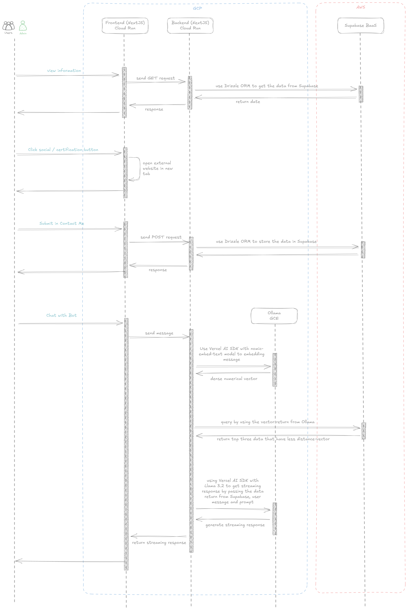
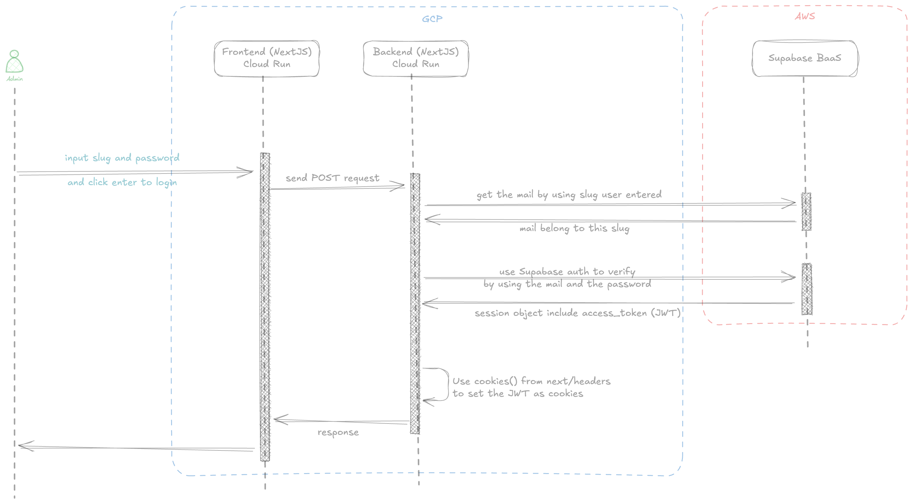
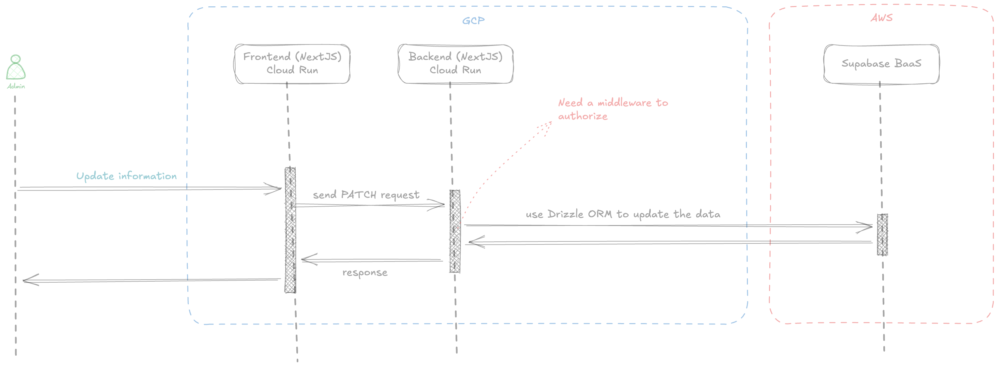
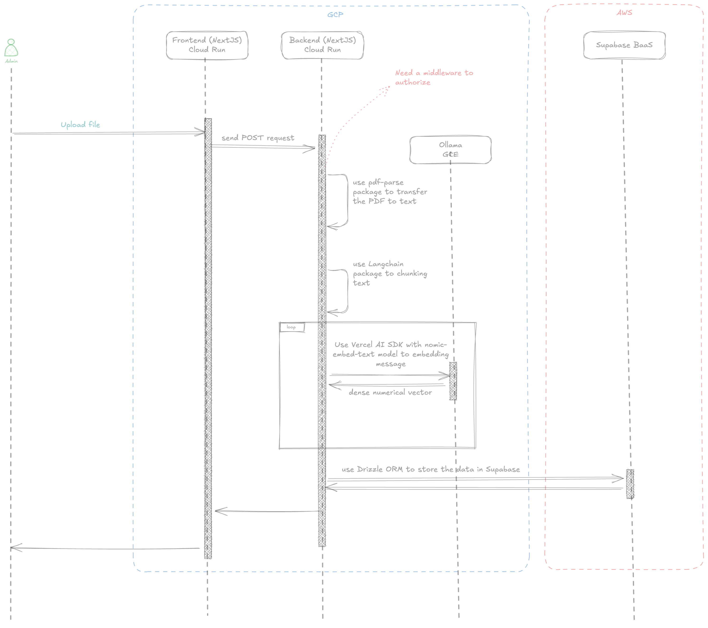
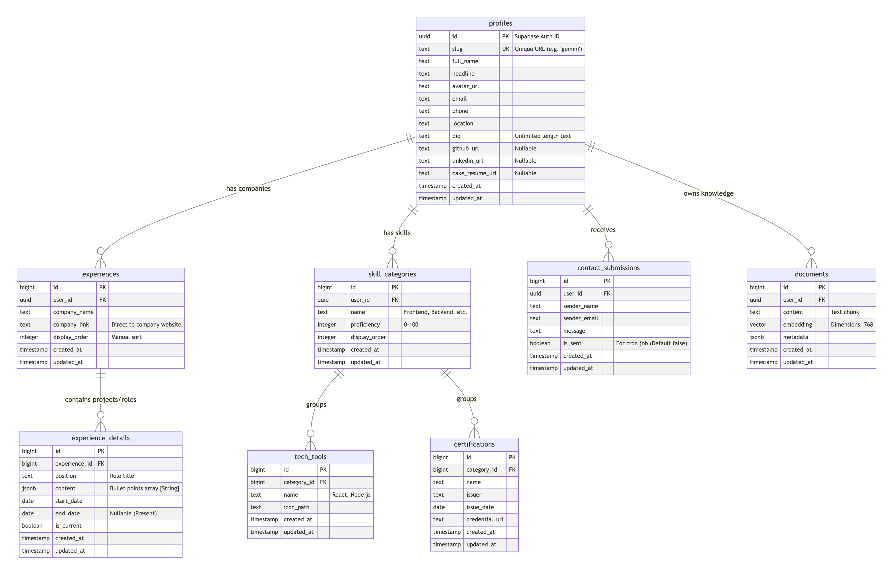

# Branding Web

This is a personal branding and portfolio web application built with Next.js, leveraging a modern tech stack to deliver a dynamic and interactive user experience. The application features a comprehensive backend to manage profile data, an AI-powered chat assistant for user engagement, and a complete administrative panel for content management.

## Core Features

- **Dynamic Portfolio:** Displays a user's professional profile, including work experiences, skills, certifications, and more, fetched from a dedicated backend.
- **AI Chat Assistant:** An integrated chat powered by Ollama and the Vercel AI SDK that can answer questions about the user's professional background based on their profile data.
- **Theming:** Supports both light and dark modes, switchable via a UI toggle, using Material-UI's theming engine.
- **Admin Panel:** A secure section for administrators to log in and upload/manage profile content.
- **Schema-Driven Development:** Utilizes Drizzle ORM for type-safe database interactions with a PostgreSQL database, including schema definition and migrations.
- **Layered Architecture:** Follows a clean architecture pattern, separating concerns into repositories (data access), services (business logic), and API routes (presentation).

## Tech Stack

- **Framework:** Next.js 15 (App Router)
- **Language:** TypeScript
- **Database:** PostgreSQL
- **ORM:** Drizzle ORM
- **UI:**
  - React
  - Material-UI
  - Tailwind CSS
- **AI & Machine Learning:**
  - Ollama
  - Vercel AI SDK
- **Testing:**
  - Vitest
  - React Testing Library
- **Tooling:**
  - ESLint
  - Prettier
  - Husky (for pre-commit hooks)
  - Turbopack

## Getting Started

### Prerequisites

- Node.js `v20.11.0` or later (`nvm use`)
- npm `v10.2.4` or later
- Access to a PostgreSQL database (e.g., via Supabase)
- [Ollama](https://ollama.com/) running locally for the AI chat feature

### Environment Setup

1.  Clone the repository:

    ```bash
    git clone https://github.com/kevinshih-689/branding-web.git
    cd branding-web
    ```

2.  Create a `.env.local` file in the root of the project and add the necessary environment variables.

    ```env
    # Your connection string
    OLLAMA_PORT=XXXXXX
    OLLAMA_BASE_URL=http://xx.xxx.xxx.xxx:$OLLAMA_PORT

    # Your PostgreSQL connection string
    SUPABASE_PROJECT_REF=
    SUPABASE_PROJECT_PASSWORD=
    SUPABASE_PROJECT_REGION=
    SUPABASE_PROJECT_URL=
    ```

### Installation

Install the project dependencies using npm:

```bash
npm install
```

### Database Migration

Apply the database migrations to set up your database schema:

```bash
npm run db:generate
npm run db:migrate
```

### Running the Application

Start the development server:

```bash
npm run dev
```

Open [http://localhost:3000](http://localhost:3000) with your browser to see the result.

## Available Scripts

- `npm run dev`: Starts the development server with Turbopack.
- `npm run build`: Creates a production build of the application.
- `npm run start`: Starts the production server.
- `npm run lint`: Lints the codebase using ESLint.
- `npm run format`: Formats all files using Prettier.
- `npm test`: Runs the test suite using Vitest.
- `npm run test:coverage`: Runs tests and generates a coverage report.
- `npm run db:generate`: Generates new Drizzle ORM migration files based on schema changes.
- `npm run db:migrate`: Applies pending database migrations.
- `npm run db:studio`: Opens the Drizzle Studio to inspect and manage your database.

## Folder Structure

```
./branding-web/
├── docs
│   └── images
├── drizzle
│   └── meta
├── public
└── src
    ├── app
    │   ├── admin-panel
    │   │   ├── login
    │   │   └── upload
    │   └── api
    │       └── v1
    │           ├── admin
    │           │   └── users
    │           ├── chat
    │           ├── cron
    │           │   └── send-contact-digest
    │           ├── is-alive
    │           ├── login
    │           ├── me
    │           └── users
    │               └── [slug]
    │                   ├── certifications
    │                   ├── contacts
    │                   ├── experiences
    │                   ├── profile
    │                   ├── skill-categories
    │                   └── tech-tools
    ├── components
    │   ├── Chat
    │   ├── ThemeRegistry
    │   └── ThemeToggle
    ├── db
    │   └── schema
    ├── features
    │   ├── admin-panel
    │   │   ├── components
    │   │   ├── hooks
    │   │   └── pages
    │   └── home
    │       ├── components
    │       │   └── SideToolBar
    │       ├── hooks
    │       └── pages
    ├── lib
    │   ├── api
    │   ├── ollama
    │   └── utils
    ├── repositories
    ├── services
    ├── styles
    └── types
```

## Sequence Diagram

### Home Page



### Admin Panel Login Page



### Admin Panel



### Upload Page



## DB Diagram


